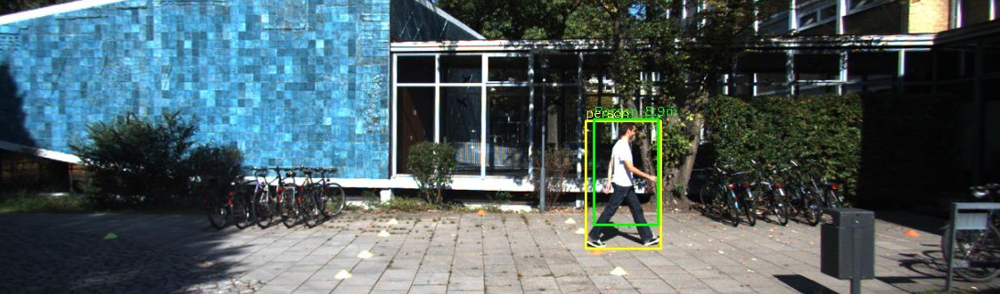
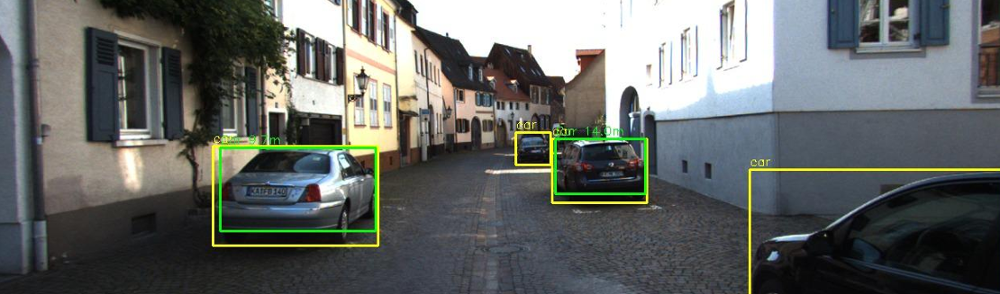
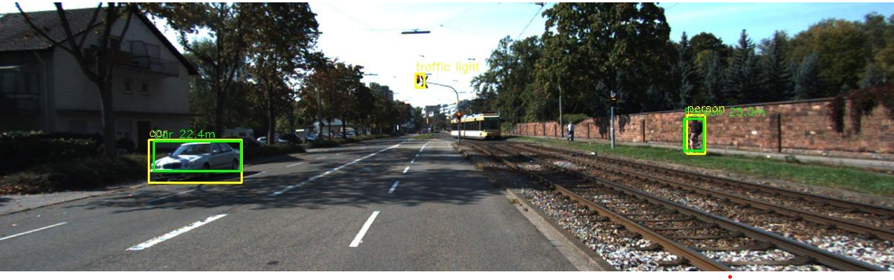
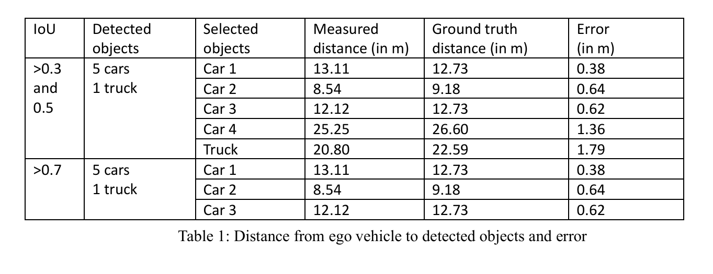
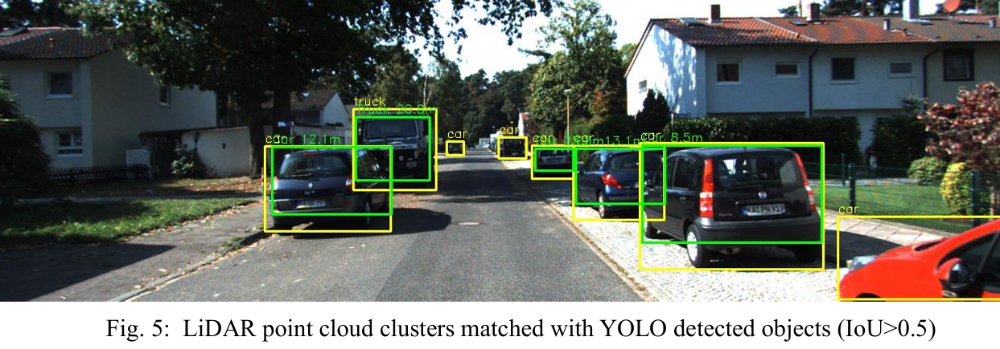

# 🚗 LiDAR-Camera Fusion for 3D Object Detection & Distance Estimation

---

## 📌 Overview

This project implements a sensor fusion system combining:

- 📷 YOLOv8 for 2D object detection
- 🌐 LiDAR point cloud clustering
- 📐 IoU-based 2D–3D matching
- 📏 Real-world distance estimation

The system improves object localization accuracy in autonomous driving scenarios.

---

## 🗂 Dataset

**KITTI Vision Benchmark Suite**

Includes:
- RGB images
- LiDAR point clouds (.bin)
- Calibration files
- Ground truth annotations

---

## ⚙️ Methodology Pipeline

### 1️⃣ YOLO Detection
Cars and pedestrians detected using YOLOv8.

.png)

---

### 2️⃣ LiDAR Clustering
Point cloud processing and cluster extraction.

---

### 3️⃣ IoU Matching
Projection of LiDAR clusters to 2D image plane and IoU matching.

---

### 4️⃣ Performance Evaluation

---

## 📊 Results Summary

- IoU threshold tuning improves matching accuracy
- Distance estimation error reduced significantly with higher IoU
- Successful matching of 3D clusters to 2D detections

---

## 🛠️ Tech Stack

- Python
- YOLOv8
- OpenCV
- NumPy
- Open3D
- DBSCAN
- KITTI Dataset

---

## 📄 Full Project Report

[Click here to view detailed report](report infosys - Copy (2) (1).pdf)

---

## 🚀 Key Highlights

✔ Integrated 2D-3D sensor fusion  
✔ Implemented IoU-based matching  
✔ Reduced localization error  
✔ Designed GPS-independent localization strategy  

---

## 👩‍💻 Author

Trupti Chimmalagi  
B.E. Electronics & Communication Engineering  
KLE Technological University  
